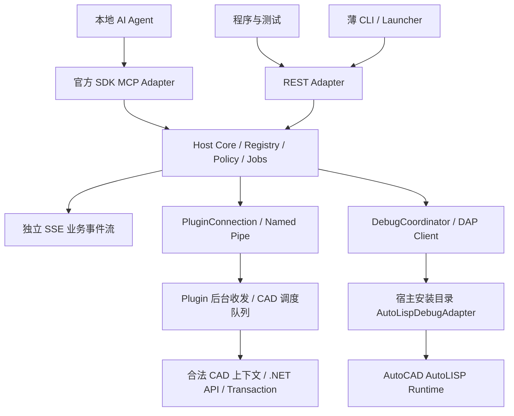

# CadBridge 技术架构设计

版本：1.0 · 2026-09-17 · 与 PRD/IMPLEMENTATION_PLAN/ACCEPTANCE 同步。

**状态：文档级设计基线；没有业务实现、构建或真机通过声明。** 可据此进入 P0/P1；G01–G04 的高风险验证不能被文档完成代替。文末 Sxx 是证据索引；ADR 是设计选择，不能与官方事实混为一谈。

## D01. 模块与依赖方向



CLI 的离线 doctor/discover 可本地只读检查；涉及 CAD 行为的请求必须经过 Host。DebugCoordinator 不进入数据库 BatchExecutor；DAP 保持自己的连接与状态机。

| 模块 | 所有者与职责 | 不负责 |
|---|---|---|
| M1 | Plugin：真实数据库/Editor/Lisp 操作与合法上下文执行 | MCP、HTTP、自然语言 |
| M2 | PluginConnection + Pipe：帧、认证、关联 ID、事件和重连 | CAD 语义、自动重放写入 |
| M3 | Host Adapters：认证、协议映射、CLI、SSE | 重写一份 CAD 逻辑 |
| M4 | Registry：能力合同、Schema、Discovery、常驻入口、结果投影 | 交易提交 |
| M5 | Host 前检/编排；Plugin 内最终校验与事务执行 | 把 LSP/磁盘副作用包装成万能事务 |
| M6 | LispService + DAP Provider + 调试/查询协调 | 自写解释器、无证据的模拟调试 |
| M7 | IRuntimeBackend 的 Live 实现 | V1 CoreConsole/ezdxf/APS |
| M8 | Legacy/Modern Shell、AutoCAD Adapter、Compat | 每个年份复制业务代码 |
| M9 | Portable Bootstrap、凭据、日志、doctor、证据与发布 | 默认安装器/永久自启动 |

## D02. Solution 与运行时

建议项目边界（具体类名可调整，依赖方向不可倒置）：

```text
src/
  CadBridge.Contracts/          netstandard2.0，DTO/错误/协议，无 CAD/MCP 引用
  CadBridge.Core/               Host 服务、Registry、权限、查询编排、任务
  CadBridge.Host/               ASP.NET Core 组合根
  CadBridge.Adapters.Mcp/       官方 C# SDK 隔离层
  CadBridge.Cli/                Launcher、薄 HTTP client、离线 doctor
  CadBridge.McpStdio/           薄 stdio -> Host MCP 转接
  CadBridge.Debug.AutoCAD/      DAP 客户端与厂商扩展适配
  Plugin.Shared/               共享源：Pipe、命令、事件、校验
  Plugin.AutoCAD/              Autodesk API 实现
  Plugin.Compat/               版本差异集中位置
  CadBridge.Plugin.Legacy/      net48，x64
  CadBridge.Plugin.Modern/      net8.0-windows，x64
tests/                         后续阶段才建立
```

Host/CLI 推荐 .NET 10 LTS 自包含 win-x64 发布，理由是 .NET 8 已接近 2026-11-10 支持终点，Host 不受 CAD 进程框架约束（S02）。插件仍保留用户指定 net48/net8 两目标。具体 SDK patch、NuGet 包在 P0 记录并锁定，不用浮动版本。Host 若因运行环境需要其他受支持 LTS，必须记录兼容证据，不随意改插件目标。

Contracts 仅保存跨进程数据，不传 Autodesk ObjectId/DBObject 或 MCP SDK 实例。请求、错误和 Schema 版本在 Core/Contracts 统一；跨 Serializer 差异必须用 Contract Tests 锁定。不要给 net48 Plugin 引入完整 ASP.NET Core/MCP SDK。

## D03. 统一命令目录与 Schema

Registry 是输入/输出合同、权限元数据与文档的唯一来源。每条能力包含：

`name, version, summary, input_schema, output_schema, category, aliases_zh, aliases_en, acad_commands, risk, required_permissions, execution_target, atomic_eligible, batchable, available_states, capability_key, result_fields`。

`execution_target` 取 host/plugin/debugger。risk 取 read/write/destructive/execute；任意 Lisp/evaluate/raw command 属 execute，不伪装成 read。MCP annotations 只是提示，真正权限检查在 Host，Plugin 再检查允许的 operation 与会话授权。

选择 JSON Schema 2020-12 为内部数据合同；投射到 MCP SDK 支持的 Schema 子集，不手写协议方言。外层对象拒绝未知字段，数值要求有限值，禁止 NaN/Infinity；句柄为字符串，Revision 为十进制字符串，避免客户端整数精度差异。Schema/DTO/验证代码由一份定义生成或统一测试，禁止分别手写三套。

P0 优先评估成熟 C# Schema 验证/生成库，确认 Host/Contracts/net48 可用性和许可；不能为“必须复用 Python”额外建立生产 Python 服务。Plugin 可复用生成的轻量 DTO/约束，Host 使用完整 Schema 验证；两端必须共享同一契约版本并验证一致。

### V1 细粒度能力边界

| 类别 | V1 operation 名称 | 执行/事务 |
|---|---|---|
| 控制 | system.status、system.capabilities、system.doctor、session.list、session.attach、session.launch、session.detach、job.get、job.cancel、events.wait | Host；不占数据库事务 |
| 文档 | document.info、document.create、document.open、document.save、document.close | info 为读；其余副作用，仅单命令 Batch；保存/关闭需授权 |
| 查询 | query.summary、query.entities、query.entity、query.selection、query.layers、query.blocks、query.text、query.region | Plugin 读；明确范围和状态 |
| 图元 | entity.create.line、entity.create.circle、entity.create.polyline、entity.create.text、entity.move、entity.rotate、entity.scale、entity.erase | Plugin，atomic eligible |
| 图层/块 | layer.create、entity.set_layer、block.insert、block.attributes.set | Plugin，atomic eligible；block.insert V1 仅已有块定义 |
| 视图 | view.capture、view.zoom_extents、view.zoom_window、view.zoom_entity | capture 读/附件；zoom 改会话视图，不进入 atomic |
| Lisp | lisp.load、lisp.reload、lisp.eval、lisp.call、lisp.run_command | Plugin Lisp Runtime，高风险，job，非原子 |
| 调试 | debug.attach、debug.detach、debug.breakpoints.set、debug.continue、debug.step_into、debug.step_over、debug.step_out、debug.stack、debug.locals、debug.watch、debug.evaluate、debug.break_on_error、debug.state | DAP Provider；控制面及停止代次约束 |

fillet/trim/plot/xref/3D 等前期例子只展示扩展方向，未进入以上清单的默认是 Future。不得让搜索结果暴露未实现 Handler。上表中的 Control 指统一 Registry 服务命令，并非“所有操作都进 Plugin”。

## D04. 七个常驻工具与低 Token 设计

| 工具 | 有界职责 | 关键参数 |
|---|---|---|
| cad_status | 小型连接/目标/文档/运行状态摘要 | session_id?，不自动附加/启动 |
| cad_query | 八种固定查询模式，映射 query.* | session_id、document_id、mode、scope、filter、fields、limit、cursor |
| cad_view | capture 与三种 zoom | target、action、window?/handle?；不扩成绘图大全 |
| search_tools | 权限/能力过滤后的索引检索 | query、limit（默认 5，最大 10）、risk? |
| describe_tools | 指定能力的签名、限制、例子、完整 Schema | names（最多 5）、detail=compact/full |
| call_tool | 调用 Registry 中一项能力 | name、args、target、idempotency_key? |
| cad_batch | 统一有界 Batch 请求 | 完整 BatchEnvelope，不内嵌全量 command oneOf |

default endpoint `/mcp` 固定七个名称；`/mcp/lisp-dev` 固定增加 lisp_runtime/debug_control/debug_inspect 三个小入口，profile 不在单次调用中动态漂移。工具名顺序固定。能力是否可用由目标 Capability/Policy 决定，而不是把某个 CAD 的所有命令注入 tools/list。

长尾调用：search 返回短签名+必需字段类型+风险+能力版本；复杂参数 describe 获取 Schema；知道且验证过合同可以跳过 search。不是每次固定三轮。失败返回字段路径、期望类型和小型签名，不回传全目录。

通用 `call_tool.args` 不代表失去内部强校验：解析具体 name 后必须按对应 Schema 校验，再检查权限、目标状态与事务资格。外层 MCP 对任意 object 的校验不够。batch 中也必须逐项进行同样检查，且禁止通过 call_tool/batch 递归包装来绕过 policy。

搜索复用 U-C4N 的词典/排名思想与 mcp-scout 的 describe/error 签名（S10/S11）；不直接移植其私有框架 hook。BM25 使用成熟本地检索实现（优先评估 Lucene.NET）或经测试的轻量库，最终选择在 P0 以许可证、部署体积、中文检索和维护状态记录，不自创排名模型。中文以明确同义词/命令词切分为起点；不能直接照搬仅匹配 `[a-z0-9]` 的 tokenizer 后宣称支持中文。

Capability/权限先过滤再排名；risk 参数不能增加授权。授权变化使 catalog_version/cache 失效；已描述的旧能力在调用时仍重新验证。低风险会话不能通过精确工具名绕过搜索过滤。

Token 采用 PRD 预算；真实测量工具 Schema、搜索/描述、参数、结果、重试及客户端缓存效果。U-C4N 的 40,305/356 等仅为其项目的离线估计口径，不能标为 CadBridge 实测；客户端原生发现/缓存可能改变收益（S10/S11）。

## D05. Host 外部 API、CLI 与事件

MCP 使用官方 `ModelContextProtocol.AspNetCore`；stdio shim 用官方 Client/Server API 转接，不实现另一套 Registry。当前核验 SDK release 已有 2.2.0，P0 选择并锁定经兼容测试的稳定版（S07）。不手写版本协商，也不把协议版本等同于业务会话版本。

独立业务会话使用显式 target/session_id，不依赖 MCP transport session；新旧 MCP 客户端支持情况在 G04 测试。云端 Agent 不能仅凭 localhost URL 访问用户机器；V1 只面向拥有本机连接能力的客户端。

REST 最小路由：

| 方法/路径 | 行为 |
|---|---|
| GET /health | 最小存活状态，不暴露图纸信息 |
| GET /api/v1/status | 已认证状态 |
| GET /api/v1/catalog/search?q=... | 统一 Discovery |
| POST /api/v1/catalog/describe | names/detail |
| POST /api/v1/execute | 单命令合同 |
| POST /api/v1/batch | BatchEnvelope |
| GET /api/v1/jobs/{job_id} | 状态、结果、证据位置 |
| POST /api/v1/jobs/{job_id}/cancel | 请求取消，不保证已停止 |
| GET /api/v1/events | SSE 业务事件，不是 MCP 旧式 SSE transport |
| POST /api/v1/events/wait | 有界等待，供不能消费 SSE 的 Agent |

Lisp/debug/Bootstrap 均通过 execute 的对应 Registry operation；可有薄友好路由，但不得重复校验/实现。CLI 标准入口：`cadbridge status|discover|attach|launch|describe|execute|query|batch|lisp|debug|job|doctor`，所有 CAD 动作映射同一服务。复杂输入用 `--json-file` 或 stdin，避免 Windows shell 引号嵌套。

CLI `--json` 仅 stdout 输出结果，诊断走 stderr；退出码 0 成功、2 输入错误、3 未连接/不可用、4 冲突/拒绝、5 操作失败或部分成功、6 未知结果、7 环境受阻。异步接受返回 job_id 不等于业务完成；`--wait` 才等待终态。

HTTP 业务错误保留统一 code：400 校验、401 未认证、403 未授权、409 身份/Revision/幂等冲突、413 大小、422 不支持组合、429 队列满、503 宿主忙/离线。MCP/CLI 表层可不同，但 ResultEnvelope 和副作用必须一致。

SSE 事件带 `stream_epoch, event_id, session_id, document_id, job_id, type, timestamp, payload`；断点事件另带 stop_id/source_hash。事件 ID 用字符串。V1 每 Host 环保留有界环形缓冲（10,000 条或 10 分钟，先到为准），支持 Last-Event-ID；缺口显式 `events.gap`，客户端重新读取状态。慢消费者断开并续传，不能阻塞 CAD；不承诺无限历史。events.wait 默认 20 秒，上限 30 秒，每次有界返回，不能让 AI忙轮询。

## D06. 身份、会话与能力

实例身份 = platform + PID + process_start_time + executable_path + plugin_instance_nonce。PID/窗口标题/文件名均不能单独作为身份。session_id 绑定此实例；Host 重启可重新握手恢复仍活着的 Plugin，CAD/Plugin 重启生成新代次。

document_id 在每次 Document 打开时生成；关闭失效，打开同一路径也不是同一 document_id。外部对象引用为 document_id + handle；ObjectId 仅在进程内部使用，不对外持久化。嵌套块查询额外携带 instance_path 和变换，不能把块定义对象当作插入实例独立修改。

写入必须明确 session/document；UI切图不改变调用目标。V1 数据库写入默认要求目标仍为活动文档，不满足返回 TARGET_NOT_ACTIVE；不偷偷切图。读取可指定已打开文档，但通过合法上下文处理。需要激活时是独立授权操作，不与原子编辑混在一起。

Handshake 示例：

```json
{
  "kind": "hello",
  "protocol_min": 1,
  "protocol_max": 1,
  "plugin_version": "0.1.0",
  "plugin_instance": "opaque-nonce",
  "pid": 1234,
  "process_start_time": "2026-09-17T00:00:00Z",
  "platform": "autocad",
  "product_version": "2026",
  "product_update": "1.2",
  "runtime": "reported-at-runtime",
  "capability_version": "sha256:catalog",
  "capabilities": {
    "query.entities": {"state":"available"},
    "debug.attach": {"state":"unverified","reason":"G02 not run"}
  }
}
```

协议版本选择双方区间交集中的最高已支持版本；无交集返回 PROTOCOL_INCOMPATIBLE。Capability 区分 available/unavailable/unverified，并给原因；声明不代替实测矩阵。Debugger Capability 由 Host Provider 实际探测合并，不凭 Plugin 成功加载置 true。

## D07. Named Pipe 与调度

帧：无符号 32-bit little-endian **字节数** + UTF-8 JSON。单帧最大 4 MiB，零长度、超长、无效 UTF-8、重复关键 JSON key、深度 > 64 均拒绝。读取必须处理拆包、粘包、EOF；分配内存前校验长度；大图像/全量图元走附件而非无限放大帧。

Pipe 采用双工后台 reader/writer，请求/响应按 request_id 关联；writer 串行避免帧交叉。后台线程只处理字节、校验、队列和已复制 DTO。所有 Autodesk DB/Editor API 访问经 `ICadDispatcher` 进入合法 CAD 主线程/命令上下文。**DocumentLock 不是将 API 变成线程安全的许可证**；禁止后台直接操作 DB，也禁止持有 Lock/Transaction 跨 await、网络等待或调试暂停（S20）。

每个 CAD 进程一个串行执行调度器；多文档也不并行碰 CAD API。Host 可并行做不同实例的纯 I/O/Schema/检索，不能据此并行访问同一宿主。

消息类型至少 hello/request/response/event/cancel/status；业务操作使用 BatchEnvelope，心跳/握手/状态/取消不排在 CAD 任务之后。Lisp 启动尽快返回 accepted/job_id，将“等待执行完成”留在 Host job；DAP continue/step 走独立适配器链路。

V1 限额：每实例待执行 64 批；每批最多 100 步；前台数据库批默认执行预算 5 秒、硬上限 15 秒（步间协作检查）；普通查询预算 2 秒；Lisp job 默认等待预算 30 秒、用户可调且显示仍在运行。长原生调用未返回时不能强行安全中断，超时进入状态核对而非宣称撤销。

Pipe ACL 使用 Windows 当前用户 SID 白名单；现代 Runtime 可用 CurrentUserOnly，Legacy 使用对应 PipeSecurity/ACL API（S21）。同用户其他进程仍不属于强安全隔离；增加一次性 Bootstrap secret 与 plugin_nonce/Host lease，避免误接或伪造普通连接。凭据绝不出现在命令行/日志。

## D08. BatchEnvelope 与结果

所有 CAD 业务单命令转换为单元素 Batch；Host/Debugger 控制命令使用同一 Registry/Policy，但不进入数据库批处理。此区分是为消除握手/取消/调试死锁，并非另写业务系统。

```json
{
  "protocol_version": 1,
  "request_id": "req-demo-1",
  "batch_id": "batch-demo-1",
  "session_id": "session-a",
  "document_id": "doc-a",
  "expected_revision": "41",
  "idempotency_key": "write-demo-1",
  "mode": "atomic",
  "timeout_ms": 5000,
  "commands": [
    {"id":"s1","operation":"entity.create.circle","params":{"center":[100,100,0],"radius":50,"layer":"0"}},
    {"id":"s2","operation":"entity.move","params":{"handles":[{"$ref":{"step":"s1","path":"/result/handle"}}],"displacement":[10,0,0]}}
  ]
}
```

步骤引用使用显式 `$ref` 对象及 JSON Pointer，仅允许引用前序步骤公开结果；不 eval、不做任意字符串插值。前期 `$step1.handle` 是表达意图的示例，这里使用不与普通字符串冲突的合同。Host 先校验依赖和结构，Plugin 在结果绑定后再校验真实参数。引用失败/回滚步骤不能生成可用句柄。

ResultEnvelope：

```json
{
  "request_id":"req-demo-1",
  "batch_id":"batch-demo-1",
  "status":"succeeded",
  "ok":true,
  "committed":true,
  "revision_before":"41",
  "revision_after":"42",
  "results":[
    {"id":"s1","status":"succeeded","result":{"handle":"2AF"}},
    {"id":"s2","status":"succeeded","result":{"handles":["2AF"]}}
  ],
  "error":null,
  "warnings":[]
}
```

Revision 数字只是示例，不承诺每批严格 +1。status 取 queued/running/succeeded/failed/partial/cancel_requested/cancelled/outcome_unknown；非终态 ok=null。committed 仅对 atomic 为 bool；读操作/best_effort/Lisp 为 null，依赖逐步状态判断。atomic 失败时前序试执行标 rolled_back，未执行标 skipped，失败步标 failed，不输出“已成功创建”的可用资源引用。

错误字段：`code, message, retryable, operation, step_id, field_path, expected, actual, recovery, evidence_id`。最小代码集合：VALIDATION_ERROR、PERMISSION_DENIED、SESSION_EXPIRED、DOCUMENT_CLOSED、TARGET_NOT_ACTIVE、REVISION_CONFLICT、REVISION_UNTRUSTED、CAD_BUSY、DEBUG_BUSY、DEBUG_QUERY_UNSAFE、CAPABILITY_UNAVAILABLE、NON_TRANSACTIONAL_COMMAND、IDEMPOTENCY_CONFLICT、IDEMPOTENCY_EXPIRED、SOURCE_CHANGED、STALE_DEBUG_HANDLE、LOAD_BLOCKED_BY_POLICY、TIMEOUT_WAITING、OUTCOME_UNKNOWN、PROTOCOL_INCOMPATIBLE。

retryable=true 仅表示满足 recovery 条件后允许重试，不是客户端可以盲重放写操作。

## D09. 事务、Revision 与幂等

### 原子数据库批

Host 做 Schema/权限/依赖结构前检，Plugin 在合法 CAD 上下文重新检查 target、状态、Revision，获得目标 DocumentLock，打开一个由 BatchExecutor 拥有的 Transaction。Handler 使用传入的 Transaction，不自行提交、保存、调用交互命令或启动异步工作。全部步骤及后置校验成功才 Commit；异常则 Abort/Dispose，并报告真实状态。

静态前检不能拒绝“本批前面将创建的图层”；依赖结构可提前验证，具体存在性在相应步骤绑定参数后再检查。禁止当前批中的中间 Handle 流到外部消费者后再回滚。

包含写入的atomic批仅限注册为atomic_eligible的数据库操作；全只读批按D18的只读一致性语义执行，不虚报写Commit。document.open/close/save、zoom、Lisp、debug 和文件输出不合格，**执行第一步之前拒绝整个非法组合**。一个 Transaction 不等于任意用户撤销组，也不保证外部 Reactor 的文件副作用；V1 atomic Handler 禁止自己产生外部副作用，第三方 Reactor 影响在证据中列明。

best_effort 每个独立数据库步骤拥有自己的 Transaction；某步失败撤销本步，已提交步骤保留。V1 为保证简单和目标一致性，在单次合法调度内串行完成整个有界批，不跨 await 释放后悄悄接着执行；预算到则未执行步标 skipped_budget。依赖失败标 skipped_dependency。外部副作用 operation 的 batchable=false，仅允许单元素 best_effort，不把其结果假定可撤销。

### Revision 是保守失效标记，不是数据库自带全局版本号

Plugin 为每个 document_id 维护单调递增序列及 `revision_trust=trusted/untrusted`。订阅对象新增/修改/擦除、命令/Lisp 边界、Undo/Redo、文档生命周期等事件；回调只登记 dirty，不在 Reactor 内重入修改数据库。合法安全边界排空 dirty 再返回查询的 Revision。

写入队列中的检查必须发生在真正执行时；Host 收到请求时检查一次不足以排除排队期间的人工修改。Plugin 在锁定目标并准备 Transaction 后再次验证 expected_revision。失去事件连续性、重连代次不明或无法判断当前状态时，设置 untrusted，拒绝保护性写入并要求重取可靠上下文。

外部修改/Undo/Redo 即使最后图形看似一样也可能使 Revision 增长；atomic 回滚也可能触发保守失效，**不要要求 rollback 后 Revision 数值不变**。验收分别检查数据库语义不变和旧观察失效，不用二进制 DWG hash 或 Handle 分配器未变化来定义回滚。

只统计 CadBridge 自己的修改不满足 R11。G03 必须覆盖用户手工编辑、外部 LSP、Undo/Redo 和排队竞争；无法覆盖的对象/事件在能力矩阵说明，不假称万无一失。

### 幂等与未知结果

幂等作用域 = plugin_instance + document_id + client_principal + idempotency_key。对写操作、Lisp job 的启动均要求 key。载荷摘要由规范化后的目标、mode、commands、expected_revision 和影响执行的选项生成；排除 request_id/等待预算。规范化规则须在 Contracts 测试，不能每种接入各算一次。

Plugin 在执行队列前原子登记 key：未见 → accepted；同键同摘要且进行中 → 返回原 job；终态 → 返回原结果；同键异摘要 → IDEMPOTENCY_CONFLICT。Host 也记录请求/结果便于恢复，但 **Plugin 去重才防止 Host 重启后重发造成重复**。

V1 在同一存活 Plugin 会话内保留全部已接受写入 key 和终态摘要（至少 10,000 条上限）；接近上限拒绝新工作并给出诊断，不静默驱逐后再次执行旧 key。详情可本地持久化、摘要/tombstone 不丢。Host 重启而 Plugin 尚在时先查询；CAD/Plugin 崩溃或无法证明最后提交状态时为 OUTCOME_UNKNOWN，冻结该文档后续自动写入，要求人工/独立读回解决。

不声称“本地日志 + DWG Commit”实现跨进程崩溃的原子双写。新 session 下旧 key/旧 document_id 不得自动迁移为新请求。

## D10. 查询、对象表达与视觉证据

坐标默认 WCS，单位为 **drawing units**，另返 INSUNITS；角度在 Contract 中用 degrees，并在 Adapter 转换。不得静默将单位无定义图当成毫米。二维输入补 z=0；圆/曲线需记录 normal/elevation，弧记录方向。缺省 scope=model，layout 模式必须带布局名，禁止“paper”含糊指任意布局。

基础图元 DTO：`document_id, handle, dxf_type, runtime_class, layer, color, visibility, space, bbox, geometry, text, attributes, unsupported_fields`，只返回请求字段。bbox 可能不可得，返回 null+reason；SPLINE/HATCH/自定义实体不凭顶点粗算面积并冒充精确值。

块默认返回 INSERT 实例与属性；可选有界展开（深度最大 8），带 instance_path、累计 WCS transform，检测循环/外参未解析。默认不跨 DWG 加载外参，不自动 explode Proxy。只读能识别的自定义对象返回真实类型/基本属性；未支持几何明确标 unsupported。

region 默认做 **bbox 候选筛选**，输出 `match_semantics=bbox_candidates`；只有实现并验证精确相交的类型才允许 exact，不能把范围包围盒当作几何精确选择。

分页 cursor 为 Host 签名不透明 token，绑定 session/document/revision/filter/fields/scope；排序稳定，按 Handle 规范顺序。下一页遇 Revision 变化返回 CURSOR_STALE，不拼接两个版本的实体；同页复制 DTO 前后发生无法校验的变更则拒绝或重取，不返回假快照。selection 同时带选择内容指纹；长期修改目标最终为明确 handles，不复用可变“当前选择”。

默认 limit=100、最大 500；默认文本结果 64 KiB。大几何/图像写到受控 `data/artifacts/`，返回 artifact_id、hash、大小、类型、生成上下文、过期策略；必须有认证的附件读取路径，不能只返回用户无法访问的内部路径。MCP ImageContent 仅按请求取有界图像，不把 Base64 当普通文本塞满上下文。

view.capture 优先使用能验证来源的 CAD 视图捕获能力；实际 API/后台窗口行为由 G01/G05 选择。每份图像带 session/document/revision/视图参数/time；若只能屏幕抓取，必须检测遮挡/最小化并报受限，不自动抢焦点。缩放是独立视图副作用，不能计入数据库 atomic 成功。

## D11. Lisp Runtime 与输出

LispService 以受控 job 管理 load/reload/eval/call/run_command，记录源码路径、字节 SHA-256、解码编码、文档/实例和工作目录。load 成功不代表文件中所有函数业务正确。reload 只重求值定义，**不会清掉旧定义、全局变量、Reactor 或外部文件副作用**；完整隔离测试用一次性文档/新会话，并说明文档隔离也未必清理全进程状态。

优先使用官方可用的 .NET→Lisp 调用入口/注册 LispFunction 回传；确需命令流时使用具有关联 ID 的结束回执，不以 SendCommand 已排队、固定 sleep 或窗口文字变化认定完成。G02 验证各目标版本的返回值、异常和回执匹配；不自建 Lisp 解释器。

语义：`lisp.call` 的函数符号和参数由专用 Lisp 值序列化构造，禁止任意字符串拼接；`lisp.eval` 明确允许任意代码，仅授权 execute 会话可用。结果使用 tagged value 表达 nil、T、数值、字符串、列表和不可序列化对象；可附有界 printable，不把所有对象硬转普通字符串导致类型丢失。

输出优先接官方 Debug Adapter output/runtimeerror 及受控回执；完整命令行流可否取得必须实测。返回 `output_coverage=complete/partial/unavailable`、来源及截断标记；无行号就返回 null，不能估算一个看似精确的位置。不得全局替换用户的 princ/*error* 等函数来假装无侵入捕获。若需要日志系统变量辅助，必须明确授权、记录原值并可恢复；V1 默认不永久修改日志设置。

LISPSYS、编码与断点源文件版本绑定。旧宿主/MBCS 需用户指定可无损编码；无法表示的路径/文本返回 ENCODING_UNSUPPORTED，不能静默用 `?` 替换。现代 Unicode 路径先读取实际引擎；LISPSYS 改动需重启且写注册表，默认不改（S19）。可在项目受控 ASCII 路径保存经授权的测试副本，但断点映射/源码 hash 必须重新绑定，不暗改用户原件。

Lisp job 状态包括 accepted/running/waiting_for_input/stopped/completed/failed/outcome_unknown。DCL/getpoint/entsel 等交互等待不是死循环；不能用任意键盘消息强行响应用户绘图过程。预算超时仅停止客户端等待并请求协作取消；无法证明停止时保留 unknown/busy，不 Thread.Abort，不杀 acad.exe。

## D12. 真正 Debug Provider 与暂停协调

官方扩展的源码说明：Windows 适配器路径来自所选 acad.exe 同目录的 `AutoLispDebugAdapter.exe`；Attach 创建独立适配器并传所选 processId/program，Runtime 有 `runtimeerror` 等厂商事件（S03/S04）。这为 Host 自行作为 DAP Client 提供依据，**不是本项目已完成无 VS Code 调试的证明**。

DAP Client 使用成熟库/官方协议数据结构；Content-Length framing、seq/request_seq、initialized/stopped/output/terminated 由 DAP 层负责，不能套用 Named Pipe 的 4-byte 帧。厂商事件集中在 AutoCAD Debug Provider，核心服务不依赖私有字段。

基本序列：探测正确宿主适配器 → initialize → attach → 按适配器事件时序设置断点/异常策略 → configurationDone（若能力支持）→ 运行 → stopped → stackTrace → scopes → variables/evaluate → next/stepIn/stepOut/continue。实际时序、异常 filter ID、断点绑定和 attach 参数由 G02 捕获协议证据；不能凭通用 DAP 规范臆造 Autodesk 支持项。

调试会话独立 `debug_session_id`，每次停止生成 stop_id；frameId/variablesReference 仅在对应 stop_id 有效，恢复运行后旧引用返回 STALE_DEBUG_HANDLE。断点携带 source_hash，源码变化后要求重新加载/绑定；不能继续在旧行号上报告命中。

Watch 是每个停止点重新观察值，不等于硬件/数据断点。Locals/Stack 为读取；默认只读Watch仅按变量名从scopes/variables取得值，不调用evaluate。其他表达式全部要求execute权限并标明可能有副作用，不能仅因表达式长得像算术就宣称安全。不要把调试Evaluate变成读取权限后门。

官方公开列出断点、单步、Watch/栈等能力，也明确若干功能未支持；V1 不要求 Pause、条件/数据断点、Set Variable、Logpoint（S05）。用户要求的功能保持为真实调试验收，不能因适配器没返回而造数据补齐。

### 暂停协调矩阵

| CAD/Debugger 状态 | 允许 | 禁止/受限 |
|---|---|---|
| idle | 正常有界数据库操作、启动 Lisp | 无 |
| executing_lisp | DAP 控制、Host 状态/日志/取消请求 | 普通编辑排队或 CAD_BUSY |
| debug_stopped | DAP stack/variables/step/continue；仅经验证安全的暂停点只读查询 | 普通 DB 写、持锁等待、自动 continue 后伪装暂停查询 |
| waiting_for_input | 状态、明确授权的交互流程 | 默认键盘注入/抢焦点 |
| outcome_unknown/disconnected | 诊断、状态恢复、独立核对 | 自动写入重放 |

**暂停时 live DB read 是关键 PoC，不是架构图画两根线就能保证。** G02 必须证明 CAD 处于断点时 Plugin 可以合法读取所需对象且不死锁/重入。如不能：返回 DEBUG_QUERY_UNSAFE，并可另取标明 captured_revision/time/stop_id 的历史快照供诊断；但该快照不算 R15 的实时目标通过。是否接受这种受限产品方案须用户批准，不能自行降级。

一个 debug session 的控制权绑定客户端租约，其他客户端不得抢 continue/step。lease 超时只解除新控制请求的授权，不自动恢复用户暂停的程序；用明确恢复流程重新领取控制权。断线时不假装已 detach。

版本范围：官方 README 及代码明确指向 AutoCAD 2021+。因此 **AutoCAD 2021–2026 是 V1 真 Debugger 的正式支持范围**，必须通过真实 DAP 验收；**2015–2020 只作为 G02 探索项**，P1 调查是否存在受支持的旧调试路径并记录证据。找不到可靠路径时将 capability 标记 unavailable/unsupported-with-evidence，不阻塞 2015–2020 的 CAD Query / Edit / Batch / Lisp Runtime V1 交付，也不得把 VS Code 扩展的开源许可理解为可自由复制厂商二进制或旧版引擎。

## D13. Portable Bootstrap、生命周期与更新

```text
CadBridge/
  cadbridge.exe
  host/                         Host 与可再分发运行时
  plugin/legacy/<build>/
  plugin/modern/<build>/
  config/config.json
  data/{sessions,jobs,artifacts,cache}/
  runtime/{endpoints,secrets,locks}/
  logs/
  notices/
```

V1 默认普通用户进程，不 Windows Service、不自动全局开机启动。CLI attach/launch/显式 MCP shim 启動可以拉起 Host；多个客户端共用同一 portable_root 下已验证 Host。root_id+用户 SID 的单实例锁避免重复启动；不同目录不得无提示抢占同一 Plugin 控制权。

发现：读已安装产品信息、运行进程路径/启动时间/窗口 PID。COM 只用于 Bootstrap，GetActiveObject 不保证选中任意指定 PID；必须验证 COM 对象 HWND 所属 PID/启动时间再 NETLOAD。不能准确绑定则 `ATTACH_AMBIGUOUS`，保留人工 NETLOAD 兜底，不调用 Dispatch 偷开实例。同一版本多实例测试为 G01 必测。

显式 launch 指定安装记录/产品路径，记录新进程身份，等宿主可接收请求再载入。不得拿任意打开窗口当已启动目标。NETLOAD 后以 Plugin 的 nonce/hello/目标身份确认，而不是命令文本送出就算成功。

Bootstrap 授权材料以当前用户 ACL 的一次性文件或受控句柄传递，路径位于 portable runtime；只允许该目标读取/连接。Plugin 通过自身 assembly 位置和受控 bootstrap 信息发布端点，Host 验证，不扫描/信任任意可写目录中的 descriptor。

SECURELOAD/TRUSTEDPATHS/管理员策略可能阻止 .NET/LSP 加载（S18）。默认不得设置 SECURELOAD=0，不持久添加信任路径，不自动提权。返回 LOAD_BLOCKED_BY_POLICY 并给出安全操作说明；在已有受信任位置、受信任签名或用户明确批准的环境下加载。绿色与“任何目录均能无提示加载”不能同时保证。

同进程 NETLOAD 不设计热卸载：detach 只关闭桥接服务/解绑客户端，不代表程序集从 CAD 内存删除。更新采用版本目录并排，等待用户结束旧 CAD 会话再切换；禁止覆盖已加载 DLL、强制关图或自动保存。Host 更新也须排空/移交任务，不能在 write running/debug stopped 时自动换版。V1 仅离线换目录，在线升级是 Future。

全部自有文件尽量归 portable root；不可写直接诊断，不偷偷回退用户 AppData。系统/AutoCAD 自己的临时/日志/授权文件不受此承诺。跨机器复制时 secrets 重新生成，不能复制 DPAPI 密文后假称仍可用。Nextcloud/共享目录应排除 runtime/secrets/logs/证据敏感数据同步；默认无自动上传。

## D14. 安全、附件与诊断

Host 绑定 127.0.0.1（需要 IPv6 时仅 ::1），随机可用端口并写受保护 endpoint descriptor；客户端每次验证 instance_nonce、PID/start_time 和认证，不能因同端口被复用连接到陌生服务。默认无公网监听和 CORS。认证使用高熵 token、恒定时间比较、凭据轮换；非允许 Origin/Host 拒绝，健康接口外不裸露状态。不要把“localhost”当作完整认证。

凭据以 DPAPI CurrentUser+ACL 存在 portable runtime/secrets，不写普通 config、CLI 参数、URL query、日志或诊断包。DPAPI 不防同用户恶意进程，此系统不是安全沙箱。MCP risk hints、搜索过滤都不能替代服务端授权。

文件读/写按显式允许根目录；规范化后检查最终路径/reparse point、UNC/设备路径、覆盖行为与扩展名。已有用户文件默认不覆盖。任意 LSP 可通过 AutoCAD 权限访问文件/网络，路径白名单只约束 Bridge API，并不能沙箱化 Lisp；execute 权限只授予可信源码，默认不给远程客户端。

附件 GET `/api/v1/artifacts/{artifact_id}` 需同一身份授权，路径不直接由用户控制；提供 range/大小/hash，默认保留 24 小时，可手动清理，正在引用的 job 不清理。敏感 DWG/源码默认不进入日志；支持包由用户显式生成，脱敏后可预览。

结构化日志：timestamp、request_id、batch_id、session_id、document_id、job_id、operation、phase、duration_ms、revision_before/after、outcome、error_code。推荐 Microsoft.Extensions.Logging；采用成熟滚动文件 provider，审查许可证；不自写日志服务器。分文件有大小/数量上限，日志失败不能改变已提交结果。

doctor 默认只读离线/在线诊断，区分 NOT_INSTALLED、NOT_LOADED、BUSY、UNAUTHORIZED、PROTOCOL_INCOMPATIBLE、DEBUG_UNAVAILABLE、UNVERIFIED、HEALTHY。`--repair` 若未来提供，也必须具体列出计划并经授权，不能作为检查附带动作。

## D15. 多版本、可复用组件与升级

Legacy/Modern 共享源编译方式参考 S09；Legacy 以最低目标 SDK 能力为交集，Modern 以 2025 API 起点。Autodesk DLL 仅编译引用，运行从宿主解析，不随绿色包复制 acmgd/acdbmgd/accoremgd。NuGet AutoCAD 包名不代表官方发行，P0 检查来源、版本和再分发限制。

net48 程序能在更新 Framework CLR 上运行，不等于所有 Autodesk SDK/API 二进制都兼容；记录 TFM、引用 SDK、实际宿主 Runtime、AutoCAD 完整 build/update、OS/.NET、语言包、插件 hash。2026 Update 1.2 的 .NET 10 变化必须独立测试 net8 插件；失败先隔离具体 API/加载差异，只有证据充分才增加 Shell，不提前抛弃两目标方案。

未来接口限于 IRuntimeBackend、ICadDispatcher、ICadQueryService、ICadCommandExecutor、ILispRuntime、ILispDebugProvider、IViewService 等服务边界。V1 用真 AutoCAD 类型在 Adapter 内工作；不包装每种 Entity。CoreConsole 不承诺 Editor/UI/DAP 等能力；未来接入以 Capability 子集呈现。

复用分层：官方协议 SDK/标准库直接依赖；CAD 词典/独立合同测试在许可允许且能力映射准确后复用；不同语言框架只借鉴设计，不为一小段搜索增加常驻 Python/Node 进程。许可未查清不复制代码，许可证兼容不等于上游运行正确。

升级：记录依赖清单/锁文件/来源 commit → 升级分支 → API/Schema diff → Contract/Fake/DAP/真实 CAD 回归 → 评审 → 发布。稳定 SDK 与 Experimental API 分开隔离；major/行为变更必须迁移说明；不由运行中的工具自动升级 SDK/Plugin。

## D16. 技术决策记录与高风险门

| ADR | 决策/原因 | 验证/影响 |
|---|---|---|
| ADR-01 | 保留 .NET Plugin + Named Pipe；HTTP/SDK 留在 Host | G01，控制依赖和宿主污染 |
| ADR-02 | 7/10 固定入口+独立细粒度合同；不保证元工具自动省固定比例 Token | G04，真实客户端总成本 |
| ADR-03 | 业务 Batch 与控制/DAP 分流；不持事务跨调试暂停 | G02/G03，防死锁 |
| ADR-04 | Revision 保守失效；unknown 不重放；atomic 仅数据库集合 | G03，拒绝虚假 exactly-once/回滚 |
| ADR-05 | 官方真 Debugger 正式支持范围为 2021–2026；2015–2020 Debugger 仅 G02 探索，不阻塞其基础 V1 能力 | G02 记录旧版探索结论；2021–2026 真调试仍是强制 Gate |
| ADR-06 | net48/net8 两插件目标保持；Host 推荐独立 .NET10 LTS；2026补丁单测 | G01/G06，避免混淆 TFM/宿主/SDK |
| ADR-07 | 绿色临时加载替代默认 .bundle；保留安全策略和显式目标校验 | G01/G05，COM不是核心 Runtime |
| ADR-08 | 暂停点实时查询必须实证；缓存永不冒充实时 | G02，核心目标不可暗降级 |
| ADR-09 | V1 只交付最小命令集和 CLI Launcher，不先建 GUI/Headless/全量命令 | G05，控制范围 |

| Gate | 必须先证明 | 未通过的处理 |
|---|---|---|
| G01 | Legacy/Modern 最小插件、安全临时 NETLOAD、明确 PID、Pipe 主线程调度及2026补丁差异 | 停依赖该运行环境的实现；保留只读诊断 |
| G02 | 无 VS Code UI 的真实 DAP、2021–2026 正式调试范围、2015–2020 探索结论、输出/编码、断点暂停的图面查询与控制不死锁 | 2021–2026 真 Debug 或暂停查询未通过则停正式 Debugger 交付；2015–2020 未找到 Debug Provider 只记录为探索结论，不阻塞基础 V1 |
| G03 | 外部修改 Revision、事务/最佳努力、幂等与断线恢复 | 禁止正式写工具上线 |
| G04 | 官方 SDK 新旧客户端/stdio、7/10 工具、Schema/权限、真实 Token/检索预算 | 修正 Adapter/发现层，不借口省 Token 放弃校验 |
| G05 | 绿色纵向链路、查询/视觉、事件/任务/安全集成 | 不交付完整可用包 |
| G06 | 支持矩阵、全部必要证据、两条真实 Agent E2E | 不宣布完整 V1 |

## D17. 证据与复用来源登记

核查日期 2026-09-17。仓库网页/main 是可变来源；下面的 blob SHA 是本次读取文件的内容标识，不冒称仓库 commit。P0 在真正导入前补齐 commit/tag、LICENSE/NOTICE 和内容 hash。未执行任何上游代码或真机测试。

| ID | 来源与本次可支持结论 | 复用方式/许可边界 |
|---|---|---|
| S01 | [Autodesk Managed .NET Compatibility](https://help.autodesk.com/cloudhelp/2026/ENU/AutoCAD-Customization/files/GUID-A6C680F2-DE2E-418A-A182-E4884073338A.htm)：SDK/Runtime 分代，2026 Update1.2 起列 .NET10 | 官方事实；不推出所有旧 SDK 均兼容 |
| S02 | [Microsoft .NET Support Policy](https://dotnet.microsoft.com/en-us/platform/support/policy)：.NET8 支持到2026-11-10，.NET10为LTS | Host生命周期依据；非强制修改插件TFM |
| S03 | [AutoLispExt README](https://github.com/Autodesk-AutoCAD/AutoLispExt)：调试范围2021+，扩展声明Apache-2.0 | 可研究扩展代码；不是厂商 adapter二进制再分发授权 |
| S04 | [debug.ts](https://github.com/Autodesk-AutoCAD/AutoLispExt/blob/main/extension/src/debug.ts) / [platform.ts](https://github.com/Autodesk-AutoCAD/AutoLispExt/blob/main/extension/src/platform.ts)：attach工厂、processId、宿主目录adapter路径；blob 33f37992fe82aa4f07ae61f107b232d6f535a7de / 3be5ead26ecb55f028548507ec102fe71a3e13bd | 复用接入信息与协议测试，不捆绑AutoCAD组件 |
| S05 | [Debugging AutoLISP Files](https://help.autodesk.com/cloudhelp/2026/ENU/AutoCAD-AutoLISP/files/GUID-09B4C574-F9FB-4F97-8728-5EAB64E13595.htm)：支持与不支持功能清单 | 官方范围；本项目仍需实测 |
| S06 | [DAP overview/specification](https://microsoft.github.io/debug-adapter-protocol/overview.html)：独立调试适配协议 | 复用协议/成熟客户端；不猜厂商扩展 |
| S07 | [C# MCP SDK README](https://github.com/modelcontextprotocol/csharp-sdk) / [releases](https://github.com/modelcontextprotocol/csharp-sdk/releases)：Core/Hosting/AspNetCore包，稳定2.x与兼容行为；README blob 71902e4e85c525041b065a5d510c542d707cb834 | 官方SDK直接依赖；README声明Apache-2.0，导入前保留对应LICENSE |
| S08 | [MCP specification](https://modelcontextprotocol.io/specification/) | 以官方SDK实现兼容；自有REST/SSE不冒充MCP标准方法 |
| S09 | [Legacy csproj](https://github.com/moshouhot/batchPrintZWCAD/blob/main/src/AcadBatchPlot/AcadBatchPlot.csproj) / [Modern csproj](https://github.com/moshouhot/batchPrintZWCAD/blob/main/src/AcadBatchPlot.Core/AcadBatchPlot.Core.csproj)：net48+20.0.1/net8+25.0.0，共享源；blob 75580b06c92585d3bdf7dcce36609ed9ded27c05 / 864d766d557fde0e2228f827262d1aaa03f1706a | 参考构建方法；本轮未查完整license，不复制业务代码/打包厂商DLL |
| S10 | [U-C4N discovery](https://github.com/U-C4N/Autocad-MCP/tree/main/discovery) / [serialize.py](https://github.com/U-C4N/Autocad-MCP/blob/main/discovery/serialize.py)：领域搜索/紧凑结果；serialize blob cdb24d278427d814a07e3b90f55747e88971093e，明确省略参数的代价 | 会话读取LICENSE为MIT；导入词典须锁commit/保留声明/重映射能力；不照搬private FastMCP hooks |
| S11 | [mcp-scout README](https://github.com/mcp-scout/mcp-scout)：search/describe/call、签名纠错、客户端差异；blob d2528cf2dfc2421838f22561370711bf9e279360 | 声明MIT；借合同/测试思路，V1不引入Node gateway |
| S12 | [GitHub MCP Server](https://github.com/github/github-mcp-server)：Toolsets参考 | 仅Profile思路；正式复制前查锁定版LICENSE，不照搬动态全局状态 |
| S13 | [beiming native README](https://github.com/beiming183-cloud/AutoCAD-MCP/blob/main/native/README.md)：受限原生事务/身份/幂等；blob 8c5eca83a8aba14f2e8ac18e7c715bede07db2ad | 仅机制参考，不把其有限操作清单视为全CAD可回滚 |
| S14 | [bimwright/dwg-mcp](https://github.com/bimwright/dwg-mcp)：外部Host与Plugin、logical batch参考 | 不沿用未经验证的线程/事务结论；直接代码复用前独立审计LICENSE/实现 |
| S15 | [puran-water/autocad-mcp](https://github.com/puran-water/autocad-mcp) | 聚合入口的对照参考；不引入File IPC/COM核心 |
| S16 | [multiCAD-mcp](https://github.com/AnCode666/multiCAD-mcp) | 批量/聚合对照；拒绝字符串shorthand作为本项目主合同 |
| S17 | [TmAgent-cad](https://skillhub.cn/skills/user_07162233/tmagent-cad)及用户粘贴介绍 | 用户材料描述MCP/REST/临时加载；闭源，未审计内部事务，不导入/再分发DLL |
| S18 | [SECURELOAD](https://help.autodesk.com/cloudhelp/2024/ENU/AutoCAD-Core/files/GUID-541566C6-2738-49DD-87C3-C1490E924A02.htm) / [NETLOAD](https://help.autodesk.com/cloudhelp/2019/ENU/AutoCAD-Customization/files/GUID-D790D6DA-4592-4C58-910F-42E4AA9EA982.htm) | 安全加载约束；不绕过管理员策略 |
| S19 | [LISPSYS](https://help.autodesk.com/cloudhelp/2022/ENU/AutoCAD-Core/files/GUID-1853092D-6E6D-4A06-8956-AD2C3DF203A3.htm) / [load](https://help.autodesk.com/cloudhelp/2022/ENU/AutoCAD-AutoLISP-Reference/files/GUID-F3639BAA-FD70-487C-AEB5-9E6096EC0255.htm) | Unicode/MBCS及重启边界，不能自动改系统变量 |
| S20 | [Lock and Unlock a Document](https://help.autodesk.com/cloudhelp/2026/ENU/OARX-DevGuide-Managed/files/GUID-A2CD7540-69C5-4085-BCE8-2A8ACE16BFDD.htm) | 官方锁定职责；主线程与非重入要求是本项目保守执行规则 |
| S21 | [PipeOptions](https://learn.microsoft.com/en-us/dotnet/api/system.io.pipes.pipeoptions) / [PipeSecurity](https://learn.microsoft.com/en-us/dotnet/api/system.io.pipes.pipesecurity) | 标准库ACL，Legacy/Modern实现差异必须构建与跨用户测试 |

重要限制：阅读README/源码不是运行验证；本次没有复用任何上游业务代码，没有宣布许可证全量审计完成。P0 的依赖清单需给实际复用物逐项 license 状态，未确认者不进入发布包。

## D18. V1最小输入/输出合同补充

本节约束后续机器Schema生成；表中未展开的通用错误、权限、身份和预算继承D03–D14。每条operation的完整Schema是P2产物，但不能擅自改变这些含义。

### 单调用公共形状

REST `/api/v1/execute` 与MCP `call_tool`使用相同数据形状（request_id由未提供的入口生成）：

```json
{
  "request_id":"req-single-1",
  "name":"entity.create.circle",
  "target":{"session_id":"session-a","document_id":"doc-a","expected_revision":"41"},
  "args":{"center":[100,100,0],"radius":50,"layer":"0"},
  "idempotency_key":"write-single-1"
}
```

Host映射为D08单元素Batch。数据库写默认atomic；读操作走只读执行；非事务操作为单元素best_effort。read无须expected_revision，但返回实际观察Revision；需要修改已存在文档的操作必须提供expected_revision。Target中的session/document不允许由args覆盖。返回ResultEnvelope与batch一致，单步结果位于results[0].result。

目标要求由Registry的target_scope统一定义，不能在各入口临时猜测：

| target_scope | 典型操作 | 身份/版本要求 |
|---|---|---|
| host | system.*、session.list/launch、catalog搜索与描述 | 已认证Host身份；不要求虚构CAD/document_id |
| session | session.attach/detach、document.create/open、debug.attach | 明确实例身份；新建/打开前无目标document_id，Batch对应document_id/expected_revision为null；只允许单步非事务请求 |
| document | query.*、entity.*、layer.*、block.*、view.*、lisp.*、document.info/save/close | session_id+document_id；数据库写入、Lisp执行、保存/关闭须校验expected_revision；纯查询/截图无需提供旧Revision |
| debug_stop | 停止态stack/locals/watch/evaluate/step/continue | debug_session_id+stop_id；控制还需controller_lease_id；以真实停止代次校验，不虚构数据库提交版本 |

普通视图缩放校验文档身份和目标状态，不以数据库Revision计一次提交。debug.detach/breakpoints.set/state按调试会话状态合同处理，不能强制要求尚未发生的stop_id。全只读Batch允许使用mode=atomic表示同一次有界一致性读取，使用只读数据库访问、不执行写Commit，返回committed=null；包含写入时必须重新检查全部步骤资格。

握手/心跳/取消使用M2控制消息；Host/Debugger operation不经过Plugin数据库Batch，但仍经过同一Registry/Policy/Job入口。

### 编辑合同

| operation | params/args | 核心返回/规则 |
|---|---|---|
| entity.create.line | start[3]、end[3]、layer="0" | handle/type；两点不得重合 |
| entity.create.circle | center[3]、radius>0、layer="0" | handle/type/center/radius；V1创建法向为WCS +Z |
| entity.create.polyline | vertices[[x,y,z]]（2..10,000）、closed=false、layer="0" | LWPOLYLINE handle；V1为WCS等z平面且无bulge输入，变化z拒绝 |
| entity.create.text | position[3]、text、height>0、rotation_deg=0、layer="0" | DBText handle；字体/样式按明确能力，不猜字体可用 |
| entity.move | handles[1..500]、displacement[3] | modified handles；空位移可返回no_change，不虚报revision已改 |
| entity.rotate | handles、base_point[3]、angle_deg | modified handles；WCS平面法向V1固定+Z |
| entity.scale | handles、base_point[3]、factor>0 | modified handles；V1均匀比例 |
| entity.erase | handles | erased handles；无效对象失败，不自动忽略 |
| entity.set_layer | handles、layer | modified handles；目标层须已存在 |
| layer.create | name、color_aci=7（1..255） | layer；存在且属性相同为no_change，冲突拒绝不覆盖 |
| block.insert | name、position[3]、scale>0（默认1）、rotation_deg=0 | INSERT handle、attribute handles；只插已存在块，不自动导入外部DWG |
| block.attributes.set | handle、values{tag:string} | changed tags；重复tag/不存在tag需明确处理，V1拒绝歧义 |

所有几何使用drawing units/WCS；string最大长度、对象数组总量受请求预算限制，P2必须为每字段生成具体上限。单个几何最大10,000顶点不表示允许100步各10,000顶点绕过4MiB帧/执行预算。

### 查询和视图合同

query共用target、`scope={space:"model"|"layout",layout_name?}`、filter、fields、limit、cursor。filter V1仅支持types数组、layer精确名、text_contains、bbox窗口；未知filter拒绝。query.entity用handle；query.selection为当前预选集并返回selection_fingerprint；query.region增加match_semantics=bbox_candidates，exact仅在实际能力支持时接受。

返回`items, returned_count, total_count|null, count_exact, cursor|null, truncated, warnings, observation`。total_count未全量计算返回null，不以扫描数冒充总数；summary可明确执行全量计数。observation含session/document/revision、scope、units、coordinate_system、captured_at、consistency=live/snapshot；暂停快照另带stale=true。

view.capture接受max_width_px（默认1280，上限2048），返回artifact及observation；zoom_window接受min/max点、zoom_entity接受handle、zoom_extents无额外几何参数。所有zoom不得隐式capture或保存文件，capture不得隐式zoom。

### 文档、Lisp与调试合同

document.create/open只接受显式路径/模板策略，返回新的document_id；create不擦除当前图。document.save需path、overwrite=false、confirm=true及write权限，默认不保存原图。document.close必须显式处理未保存状态：cancel/save/discard，缺省cancel；save/discard须对应确认，不把关闭放atomic里。

lisp.load/reload接受path、source_hash、encoding、timeout_ms；lisp.eval接受expression；lisp.call接受function_name和tagged arguments；lisp.run_command接受已定义C:命令名称和明确交互策略。启动返回job_id/status，完成通过job.get返回tagged value、output、output_coverage、error和affected_document。源码hash是实际读取字节hash，不是路径/mtime。

debug.attach接受target+program/source_hash，返回debug_session_id/controller_lease_id；debug.breakpoints.set接受文件/hash/lines及lease；step/continue需debug_session_id、controller_lease_id、stop_id；debug.stack/locals/watch需debug_session_id、stop_id、可选frame_id。watch默认names数组只读；debug.evaluate接受expression并要求execute授权。debug.break_on_error只提供enabled布尔的产品意图，厂商filter由Provider能力映射，不让模型编造filter ID。

session.attach接受已发现PID+process_start_time，session.launch接受已发现installation_id（不接受任意exe当CAD）。session.detach只断开桥不关CAD。Host选择目标不使用进程全局的“最后一张图”。

CLI的`attach --pid N`是便利语法：必须先解析此次discover记录的process_start_time/产品路径，再一起提交给Host；执行前再次核对，PID复用即失败。不得把省略CLI参数理解为内部身份校验也可省略。

### CLI固定基础语法

`cadbridge discover --json`、`cadbridge attach --pid N --json`、`cadbridge launch --installation-id ID --json`、`cadbridge execute --json-file request.json --wait --json`、`cadbridge batch --json-file batch.json --wait --json`、`cadbridge doctor --json`。

query/lisp/debug等便利子命令只组装同一SingleCall/Batch合同；没写便利包装也必须能经execute访问全部已实现operation。`--wait`超时返回job信息和等待错误，不生成新的idempotency_key重试。
